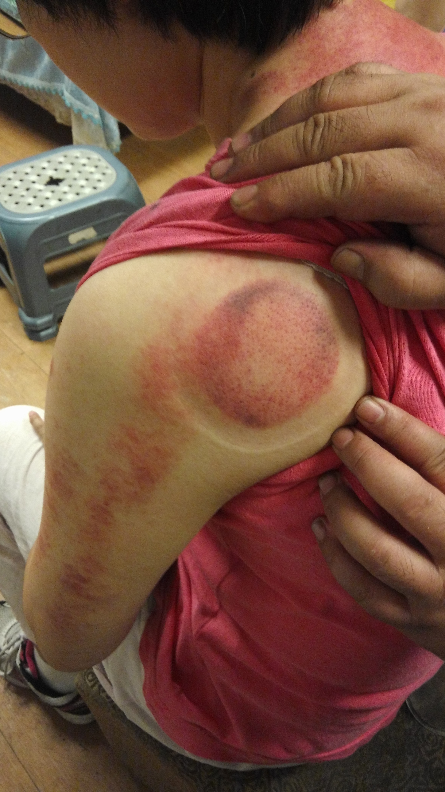
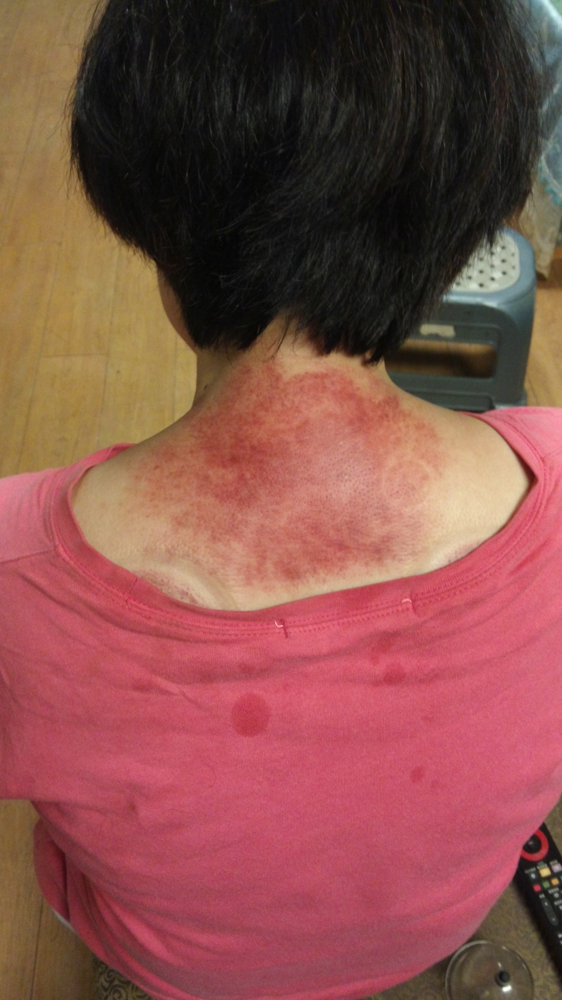
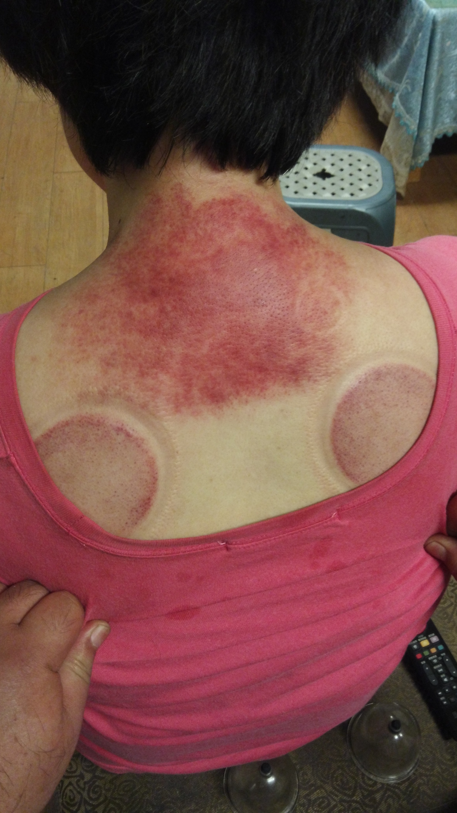

# 手麻

## 症狀

左臂後側麻

睡覺壓到不舒服，自己按摩左臂，但是並沒有比較好。以前尾椎有受傷兩次。

## 處理的思路

1. 手臂麻的地方有淤積
2. 五十肩引起
3. 脊椎壓迫

## 淤積的處理

用刮痧板刮痧，並且在手臂上方處拔罐。

如果是血路不通造成的麻，按摩之後應該會緩解。

## 五十肩的辨別

1. 讓患者左手按住右肩
2. 讓患者左手往下往後摸脊椎
3. 讓患者往前往上摸頸椎

## 頸椎的處理

脊椎壓迫的處理，先滑罐放鬆筋骨，然後拔罐。

處理之後有段時間手不麻。但是過幾分鐘後又感覺手麻。
